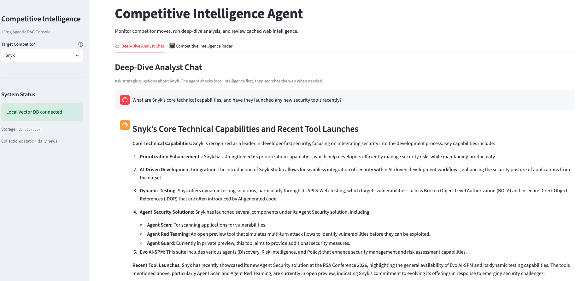
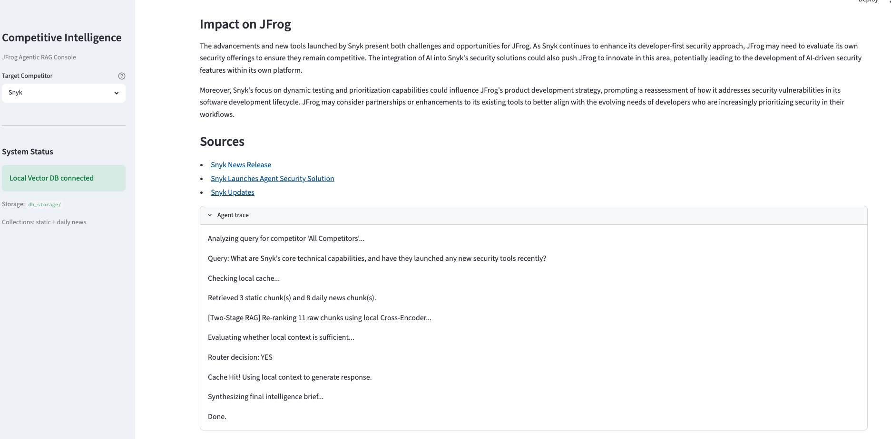
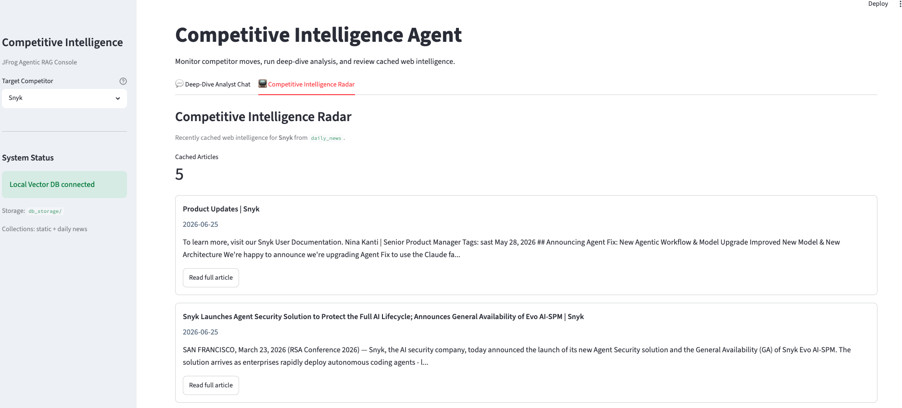

# Execution Guide: JFrog Competitive Intelligence Agent 🎯

This guide outlines the quick installation and execution steps for the End-to-End Testing Protocol.

---

## 🛠️ Step 1: Installation & Setup

### 1. Clone and Navigate

```
git clone <repository-url>
cd jfrog-competitor-intelligence

```

### 2. Initialize Virtual Environment

Bash

```
python3 -m venv venv
source venv/bin/activate  # On Windows: venv\Scripts\activate

```

### 3. Install Dependencies

```
pip install -r requirements.txt

```

### 4. Configure API Tokens

Do **not** share your credentials. Instead, create a local `.env` file in the root directory based on the provided template:

1. Duplicate the example file to create your environment configuration:
```
cp .env.example .env

```

2. Open the newly created .env file and populate it with your live API keys:
```
OPENROUTER_API_KEY=your_actual_openrouter_key_here
TAVILY_API_KEY=your_actual_tavily_key_here

```

## 🚀 Step 2: Running the Pipeline (Execution Order)

Follow this exact sequence to run the full testing protocol:

### 1. Ingest Static Knowledge Baselines

Initializes the system's core historical truth.

```
python ingestion.py

```

- **Result:** Creates the local `db_storage/` directory and populates the static intelligence collection.

### 2. Run the Proactive News Scanner

Simulates the autonomous background worker gathering live signals.

```
python cron_scanner.py

```

- **Result:** Scrapes recent competitor data, filters out web noise, and populates the dynamic daily news collection inside `db_storage/`.

### 3. Launch the Analyst Console UI

Opens the interactive graphical interface.

```
python -m streamlit run app.py --server.fileWatcherType none

```

- **Result:** Launches the dashboard at `http://localhost:{PORT NUMBER}`.
  - Use the **Chat Tab** to test Adaptive Routing (**Cache Hit** for cached data / **Cache Miss** for live web searches).
  - Use the **Radar Tab** to view the filtered news feed.

### 📊 Dashboard Preview & Trace
#### Analyst Chat Console


#### Competitor Radar Feed


### 4. Execute the Quantitative Evaluation Suite

Audits the pipeline's performance scientifically.

```
python evaluate_pipeline.py

```

- **Result:** Runs tests against the golden dataset and outputs the average **RAG Triad** scores (Faithfulness, Answer Relevance, Context Precision).

